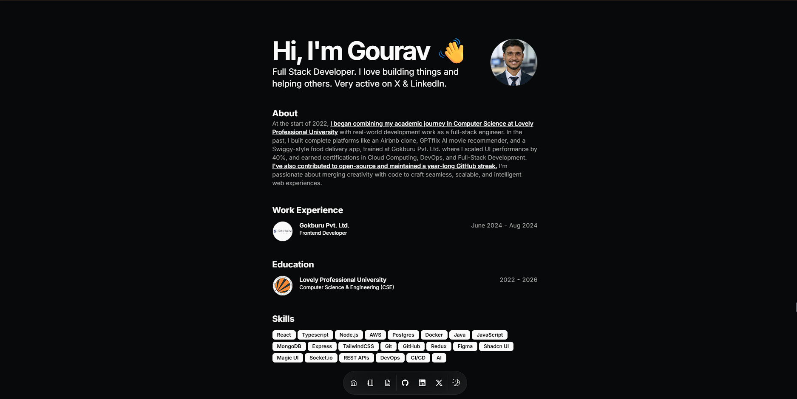
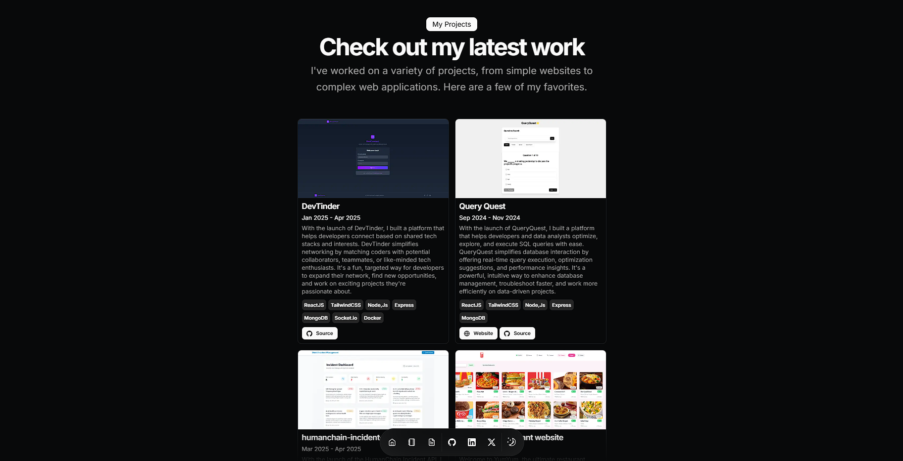

# 🚀 Gourav Chaudhary — Portfolio

<div align="center">
  
  
  
</div>

---

## 🎨 About

**Portfolio-GouravSittam** is a modern, responsive, and blazing fast portfolio website built to showcase my projects, skills, and journey as a full stack web developer.  
It’s crafted for performance, aesthetics, and ease of customization.  
Perfect for anyone looking to make an impactful impression in the digital world!

---

## 🌐 Live Demo

> **Check it out live:**  
> [https://gouravsittam.vercel.app/](https://gouravsittam.vercel.app/)

---

## 🖼️ Screenshots

<p align="center">
  
  <br><sub>Landing Page</sub>
</p>
<p align="center">
  
  <br><sub>Projects Showcase</sub>
</p>

---

## ✨ Features

- ⚡️ **Lightning Fast:** Optimized for speed and smooth animations
- 📱 **Mobile First:** Fully responsive across all screen sizes
- 🎨 **Elegant UI:** Modern, minimal, and visually appealing
- 🛠️ **Easy Customization:** Edit content via config files
- 🧩 **Component Driven:** Reusable, scalable React components
- 🌙 **Dark/Light Mode** (if implemented)
- 🛡️ **SEO Optimized** and shareable
- 🏷️ **Open Source** — Fork and personalize for your story!

---

## 🏗️ Built With

<p align="center">
  
</p>

- **Framework:** React.js
- **Styling:** Tailwind CSS / CSS Modules
- **Deployment:** Vercel
- **Extras:** Framer Motion / GSAP for animations (if used), custom SVGs, etc.

---

## 🚀 Getting Started

### 1. **Clone the repo**

```bash
git clone https://github.com/GouravSittam/Portfolio-GouravSittam.git
cd Portfolio-GouravSittam
```

### 2. **Install dependencies**

```bash
npm install
# or
yarn install
```

### 3. **Run locally**

```bash
npm start
# or
yarn start
```

> Open [http://localhost:3000](http://localhost:3000) to see your site!

---

## 🛠️ Customization

- **Update your info** in the `/src/data/` or config files (bio, skills, socials, project list, etc.).
- **Change images** in the `/public/assets` or `/src/assets` directory.
- **Tweak styles** in Tailwind config or CSS files.
- **Add/Update sections** easily by editing or creating new React components.

---

## 🌍 Deployment

Ready to share with the world?  
Deploy instantly using:

[](https://vercel.com/import/project?template=https://github.com/GouravSittam/Portfolio-GouravSittam)

Or deploy on Netlify, GitHub Pages, etc.

---

## 🤝 Contributing

Contributions welcome!  
Feel free to submit issues, feature requests, or pull requests to make this template even better.

1. Fork the repo
2. Create a branch (`git checkout -b feat/your-feature`)
3. Commit your changes
4. Push to your fork
5. Open a Pull Request

---

## 📫 Contact

<p align="center">
  <a href="mailto:gouravsittam@gmail.com"></a>
  <a href="https://linkedin.com/in/gouravsittam"></a>
  <a href="https://twitter.com/gouravsittam"></a>
  <a href="https://instagram.com/gouravsittam"></a>
  <a href="https://gouravsittam.vercel.app/"></a>
</p>

---

## ⭐ Credits

- Inspired by top dev portfolio templates and the open source community!
- Thanks to [skillicons.dev](https://skillicons.dev), [vercel](https://vercel.com), and all contributors.

---

## 📝 License

This project is open source and available under the [MIT License](LICENSE).

---

<div align="center">
  
  <br>
  <i>Crafted with ❤️ by Gourav Chaudhary</i>
</div>
